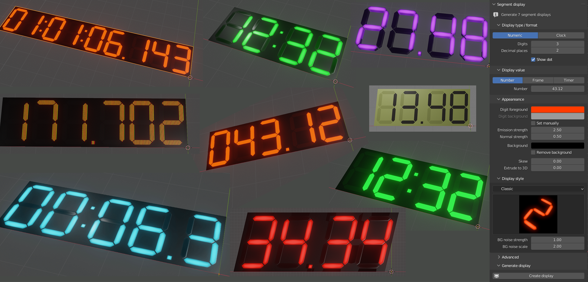

# 7 Segment Display Addon
**A Blender addon for generating animatable 7 segment displays**

## Features

- Generate displays showing any number or time (hours, minutes, seconds and ms)
- Displays can show static values or be animated by the addon
  - For example show the current animation frame or count up or down in some timeframe between set values
- Customizable colors and styles
- Powered by nodes but using real geometry

## Installation

> **NOTE**: The addon is made for Blender version 3.0.0+

Can be installed like usual by installing the addons _.zip_ archive through the Blender preferences window.  
The addon main panel is located in `3D View > Right sidebar > Segment display`

## Downloads

Download `SegmentAddon.zip` from [releases](https://github.com/xDUDSSx/segment-display-blender-addon/releases).

## Documentation

[User guide and technical explanation (**in czech**)](https://github.com/xDUDSSx/segment-display-blender-addon/blob/master/documentation_czech.adoc)

## Sources

[Sharkigator segment display blogpost, original idea](https://sharkigator.wordpress.com/2016/01/15/7-segment-display-tutorial)

[Video from Jonathan Kron, inspiration for the LCD shader](https://www.youtube.com/watch?v=fJ1WBx3kJaQ)
